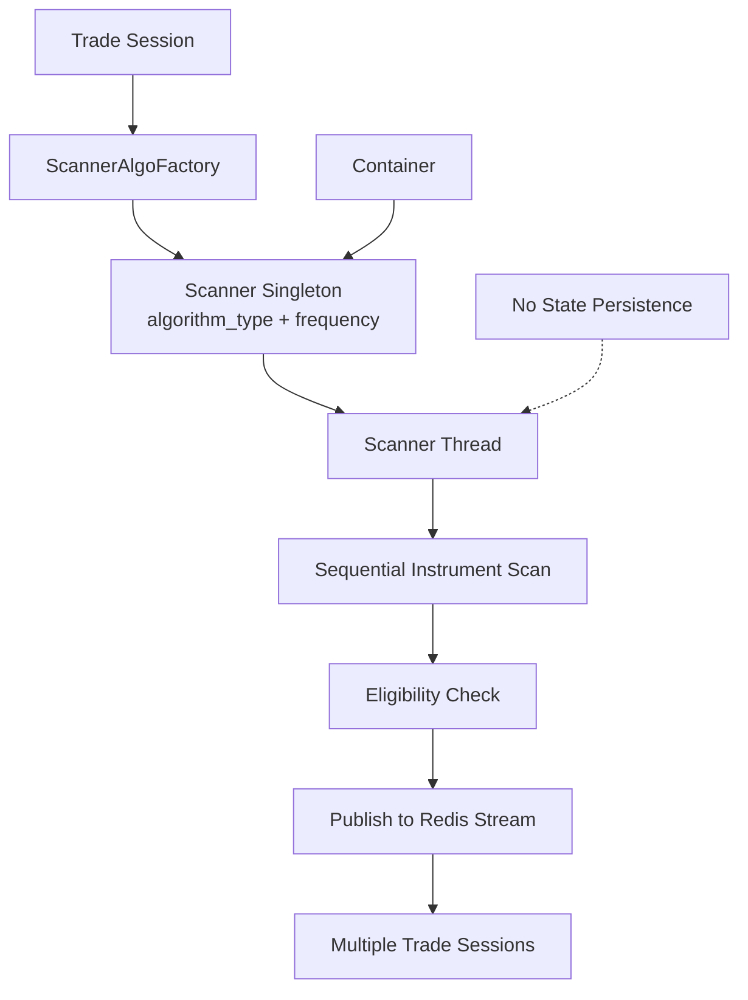
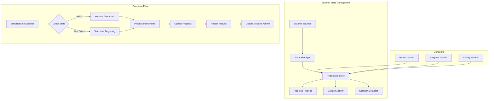

# Resilient Scanner State Management Architecture

## Executive Summary

This document proposes a comprehensive architectural redesign for the algorithmic trading scanner system to address container crash resilience and provide robust state management. The solution introduces a distributed state tracking mechanism using Redis, while maintaining the existing singleton scanner pattern and supporting multiple trade sessions per scanner.

## Comparison: Current vs Proposed Architecture

| Aspect | Current Implementation | Proposed Implementation | Impact |
|--------|----------------------|------------------------|--------|
| **Crash Recovery** | Restarts from beginning | Resumes from last position | 15-30 min saved per crash |
| **Progress Visibility** | No tracking | Real-time progress dashboard | Full observability |
| **Session Activity** | Unknown | Tracked per session | Better debugging |
| **Resource Usage** | Redundant scanning | Efficient processing | ~50% reduction in wasted cycles |
| **State Storage** | None | Redis with TTL | ~1KB per scanner |
| **Performance Impact** | N/A | <1% overhead | Negligible |
| **Monitoring** | Basic logs | Comprehensive metrics | Proactive issue detection |
| **Scalability** | Limited | Ready for distribution | Future-proof |
| **Implementation Effort** | - | 6-8 weeks | One-time investment |
| **Operational Complexity** | Simple | Moderate | Manageable with automation |

## Table of Contents

1. [Current Architecture Analysis](#current-architecture-analysis)
2. [Problem Statement](#problem-statement)
3. [Architectural Requirements](#architectural-requirements)
4. [Proposed Solution](#proposed-solution)
5. [Implementation Design](#implementation-design)
6. [Performance Considerations](#performance-considerations)
7. [Monitoring and Observability](#monitoring-and-observability)
8. [Migration Strategy](#migration-strategy)
9. [Alternative Approaches](#alternative-approaches)
10. [Recommendations](#recommendations)

## Current Architecture Analysis

### Existing Components



### Key Characteristics

1. **Singleton Pattern**: Scanners are singletons based on `(algorithm_type, frequency)` combination
2. **Shared Scanners**: Multiple trade sessions can share the same scanner instance
3. **Sequential Processing**: Instruments are scanned sequentially in a single thread
4. **Stateless Execution**: No persistence of scanning progress
5. **Long Scan Duration**: 15-30 minutes for complete instrument list scan

### Current Flow

```python
# Current implementation (simplified)
while not self._stop_event.is_set():
    for instrument in all_instruments:
        is_eligible, eligibility_obj = self.is_eligible(symbol)
        if is_eligible:
            self.publish_eligible_instruments([instrument_data])
    self._stop_event.wait(timeout=30)
```

## Problem Statement

### Primary Issues

1. **Lost Progress on Crash**: When a container crashes, scanning restarts from the beginning
2. **Wasted Resources**: Redundant re-scanning of already processed instruments
3. **Delayed Results**: Trade opportunities may be missed during re-scanning
4. **No Visibility**: Cannot determine when a trade session last received scan results

### Constraints

1. Not all scanner types need state tracking (e.g., API-based scanners)
2. Scanners are shared across multiple trade sessions
3. Need to maintain high performance with minimal overhead
4. Must support containerized deployment model

## Architectural Requirements

### Functional Requirements

1. **Resume Capability**: Scanners must resume from last processed instrument after crash
2. **Progress Tracking**: Track scanning progress per scanner instance
3. **Session Activity Tracking**: Monitor when each trade session last received results
4. **Flexible State Management**: Support both stateful and stateless scanner types
5. **Multi-Session Support**: Handle shared scanner instances correctly

### Non-Functional Requirements

1. **Performance**: Minimal impact on scanning throughput
2. **Scalability**: Support increasing number of instruments and sessions
3. **Reliability**: State persistence must be highly available
4. **Observability**: Clear visibility into scanner health and progress
5. **Maintainability**: Clean separation of concerns

## Proposed Solution

### High-Level Architecture



### Core Components

#### 1. State Management Layer

```python
class ScannerStateManager:
    """Manages scanner state persistence and recovery"""
    
    def __init__(self, redis_client):
        self.redis = redis_client
        self.state_prefix = "scanner:state:"
        self.activity_prefix = "scanner:activity:"
        self.progress_prefix = "scanner:progress:"
    
    def save_progress(self, scanner_id: str, progress: ScannerProgress):
        """Save scanner progress atomically"""
        pass
    
    def get_progress(self, scanner_id: str) -> Optional[ScannerProgress]:
        """Retrieve scanner progress for resumption"""
        pass
    
    def update_session_activity(self, scanner_id: str, session_id: str):
        """Track when a session received scan results"""
        pass
```

#### 2. Scanner Progress Model

```python
@dataclass
class ScannerProgress:
    scanner_id: str                    # algorithm_type__frequency
    current_index: int                 # Current position in instrument list
    total_instruments: int             # Total instruments to scan
    last_processed_symbol: str         # Last successfully processed symbol
    scan_cycle: int                    # Current scan cycle number
    cycle_start_time: datetime         # When current cycle started
    last_update_time: datetime         # Last progress update
    instruments_hash: str              # Hash of instrument list for validation
    state_version: int = 1             # Schema version for future compatibility
```

#### 3. Enhanced Scanner Interface

```python
class StatefulScannerMixin:
    """Mixin for scanners that require state persistence"""
    
    def __init__(self):
        self.state_manager = None
        self.supports_state_persistence = True
        
    def initialize_state_management(self):
        """Initialize state management for this scanner"""
        self.state_manager = ScannerStateManager(get_redis_client())
        
    def save_scanning_progress(self, index: int, symbol: str):
        """Save current scanning progress"""
        if not self.supports_state_persistence:
            return
            
        progress = ScannerProgress(
            scanner_id=str(self),
            current_index=index,
            total_instruments=len(self.all_instruments),
            last_processed_symbol=symbol,
            scan_cycle=self.scan_cycle,
            cycle_start_time=self.cycle_start_time,
            last_update_time=current_ist(),
            instruments_hash=self._calculate_instruments_hash()
        )
        self.state_manager.save_progress(str(self), progress)
        
    def resume_or_start_scanning(self, instruments: List[Dict]) -> int:
        """Determine starting index based on saved state"""
        if not self.supports_state_persistence:
            return 0
            
        progress = self.state_manager.get_progress(str(self))
        if progress and self._validate_progress(progress, instruments):
            log(f"Resuming scan from index {progress.current_index}")
            return progress.current_index + 1
        return 0
```

### Data Structures in Redis

#### Scanner Progress
```
Key: scanner:state:{algorithm_type}__{frequency}
Type: Hash
Fields:
  - current_index: 125
  - total_instruments: 5000
  - last_processed_symbol: "RELIANCE"
  - scan_cycle: 3
  - cycle_start_time: "2024-01-15T10:30:00+05:30"
  - last_update_time: "2024-01-15T10:45:30+05:30"
  - instruments_hash: "a1b2c3d4..."
  - state_version: 1
TTL: 2 hours (configurable)
```

#### Session Activity Tracking
```
Key: scanner:activity:{algorithm_type}__{frequency}
Type: Hash
Fields:
  - session_{id}_last_result: "2024-01-15T10:45:30+05:30"
  - session_{id}_total_results: 45
TTL: 24 hours
```

#### Scanner Metadata
```
Key: scanner:meta:{algorithm_type}__{frequency}
Type: Hash
Fields:
  - status: "running|stopped|error"
  - start_time: "2024-01-15T10:30:00+05:30"
  - last_heartbeat: "2024-01-15T10:45:30+05:30"
  - container_id: "abc123..."
  - error_count: 0
TTL: 1 hour (refreshed on heartbeat)
```

## Implementation Design

### Enhanced UDTS Scanner Implementation

```python
class UDTSScanner(BaseScannerInterface, StatefulScannerMixin, metaclass=ScannerSingletonMeta):
    def __init__(self, algorithm_type, frequency):
        super().__init__()
        StatefulScannerMixin.__init__(self)
        self.algorithm_type = algorithm_type
        self.frequency = frequency
        self.progress_update_interval = 10  # Update progress every 10 instruments
        
    def scan_in_separate_thread(self, all_instruments):
        self._ensure_configured()
        self.initialize_state_management()
        
        # Resume or start fresh
        start_index = self.resume_or_start_scanning(all_instruments)
        
        self._is_running = True
        self.all_instruments = all_instruments
        self.scan_cycle = self._get_current_cycle()
        self.cycle_start_time = current_ist()
        
        log(f'Scanning started for {len(all_instruments)} instruments from index {start_index}')
        
        while not self._stop_event.is_set():
            scan_start_time = current_ist()
            
            # Process instruments from resume point
            for idx in range(start_index, len(all_instruments)):
                if self._stop_event.is_set():
                    break
                    
                instrument = all_instruments[idx]
                symbol = instrument["trading_symbol"]
                
                # Process instrument
                is_eligible, eligibility_obj = self.is_eligible(symbol)
                
                if is_eligible:
                    # Publish results
                    self.publish_eligible_instruments([instrument_data])
                    
                    # Update session activity for all active sessions
                    self._update_session_activities()
                
                # Periodic progress save
                if idx % self.progress_update_interval == 0:
                    self.save_scanning_progress(idx, symbol)
                    self._update_scanner_heartbeat()
            
            # Reset for next cycle
            start_index = 0
            self.scan_cycle += 1
            
            # Clear progress for new cycle
            self.state_manager.clear_progress(str(self))
            
            self._stop_event.wait(timeout=30)
```

### State Manager Implementation

```python
class ScannerStateManager:
    def __init__(self, redis_client):
        self.redis = redis_client
        self.state_prefix = "scanner:state:"
        self.activity_prefix = "scanner:activity:"
        self.meta_prefix = "scanner:meta:"
        self.default_ttl = 7200  # 2 hours
        
    def save_progress(self, scanner_id: str, progress: ScannerProgress):
        """Save scanner progress atomically with TTL"""
        key = f"{self.state_prefix}{scanner_id}"
        
        with self.redis.pipeline() as pipe:
            pipe.hset(key, mapping={
                'current_index': progress.current_index,
                'total_instruments': progress.total_instruments,
                'last_processed_symbol': progress.last_processed_symbol,
                'scan_cycle': progress.scan_cycle,
                'cycle_start_time': progress.cycle_start_time.isoformat(),
                'last_update_time': progress.last_update_time.isoformat(),
                'instruments_hash': progress.instruments_hash,
                'state_version': progress.state_version
            })
            pipe.expire(key, self.default_ttl)
            pipe.execute()
            
    def get_progress(self, scanner_id: str) -> Optional[ScannerProgress]:
        """Retrieve scanner progress"""
        key = f"{self.state_prefix}{scanner_id}"
        data = self.redis.hgetall(key)
        
        if not data:
            return None
            
        return ScannerProgress(
            scanner_id=scanner_id,
            current_index=int(data.get('current_index', 0)),
            total_instruments=int(data.get('total_instruments', 0)),
            last_processed_symbol=data.get('last_processed_symbol', ''),
            scan_cycle=int(data.get('scan_cycle', 0)),
            cycle_start_time=datetime.fromisoformat(data.get('cycle_start_time')),
            last_update_time=datetime.fromisoformat(data.get('last_update_time')),
            instruments_hash=data.get('instruments_hash', ''),
            state_version=int(data.get('state_version', 1))
        )
        
    def update_session_activity(self, scanner_id: str, session_id: str):
        """Update when a session received results from scanner"""
        key = f"{self.activity_prefix}{scanner_id}"
        field_name = f"session_{session_id}_last_result"
        count_field = f"session_{session_id}_total_results"
        
        with self.redis.pipeline() as pipe:
            pipe.hset(key, field_name, current_ist().isoformat())
            pipe.hincrby(key, count_field, 1)
            pipe.expire(key, 86400)  # 24 hour TTL
            pipe.execute()
```

## Performance Considerations

### Optimization Strategies

1. **Batch Progress Updates**: Update progress every N instruments instead of each one
2. **Asynchronous State Persistence**: Use background thread for state updates
3. **Efficient Serialization**: Use MessagePack or Protocol Buffers for state data
4. **Connection Pooling**: Reuse Redis connections efficiently
5. **Progress Compression**: Store only essential progress data

### Performance Metrics

```python
class PerformanceMonitor:
    """Monitor scanner performance impact"""
    
    def __init__(self):
        self.metrics = {
            'state_save_time': [],
            'state_load_time': [],
            'scan_time_per_instrument': [],
            'redis_operations_count': 0
        }
        
    def measure_state_overhead(self):
        """Calculate overhead introduced by state management"""
        avg_save_time = sum(self.metrics['state_save_time']) / len(self.metrics['state_save_time'])
        total_overhead_per_cycle = avg_save_time * (5000 / progress_update_interval)
        return total_overhead_per_cycle
```

### Expected Performance Impact

- **State Save Operation**: ~1-2ms per update
- **State Load Operation**: ~2-3ms on startup
- **Memory Overhead**: ~1KB per scanner instance
- **Network Overhead**: ~100 bytes per progress update
- **Total Impact**: <1% of scanning time with batch updates

## Monitoring and Observability

### Dashboard Metrics

```python
class ScannerDashboard:
    """Real-time scanner monitoring dashboard data"""
    
    def get_scanner_status(self, scanner_id: str):
        return {
            'scanner_id': scanner_id,
            'status': 'running',
            'progress_percentage': 45.2,
            'current_symbol': 'RELIANCE',
            'scan_rate': '120 instruments/minute',
            'estimated_completion': '12 minutes',
            'last_heartbeat': '10 seconds ago',
            'active_sessions': 5,
            'total_results_published': 234
        }
        
    def get_session_activity(self, session_id: str):
        return {
            'session_id': session_id,
            'scanner': 'udts__5-minute',
            'last_result_received': '2 minutes ago',
            'total_results': 45,
            'session_uptime': '2 hours 15 minutes'
        }
```

### Health Checks

```python
class ScannerHealthCheck:
    """Monitor scanner health and alert on issues"""
    
    def check_scanner_health(self, scanner_id: str) -> Dict[str, Any]:
        meta = self.state_manager.get_scanner_metadata(scanner_id)
        
        health_status = {
            'scanner_id': scanner_id,
            'is_healthy': True,
            'checks': {
                'heartbeat': self._check_heartbeat(meta),
                'progress': self._check_progress_rate(scanner_id),
                'error_rate': self._check_error_rate(meta),
                'memory_usage': self._check_memory_usage()
            }
        }
        
        health_status['is_healthy'] = all(
            check['passed'] for check in health_status['checks'].values()
        )
        
        return health_status
```

### Alerting Rules

1. **Scanner Stalled**: No progress update for >5 minutes
2. **High Error Rate**: Error count >10 in last hour
3. **Memory Leak**: Memory usage growing continuously
4. **State Corruption**: Invalid state data detected
5. **Session Inactive**: No results received for >30 minutes

## Migration Strategy

### Phase 1: Foundation (Week 1-2)
1. Implement `ScannerStateManager` class
2. Add Redis state persistence infrastructure
3. Create monitoring dashboard backend
4. Add comprehensive logging

### Phase 2: Scanner Enhancement (Week 3-4)
1. Implement `StatefulScannerMixin`
2. Enhance `UDTSScanner` with state management
3. Add progress tracking logic
4. Implement resume capability

### Phase 3: Testing & Validation (Week 5-6)
1. Unit tests for state management
2. Integration tests with Redis
3. Chaos testing (container crashes)
4. Performance benchmarking

### Phase 4: Rollout (Week 7-8)
1. Deploy to staging environment
2. Monitor performance metrics
3. Gradual production rollout
4. Documentation and training

### Rollback Plan
```python
class FeatureToggle:
    """Control state persistence feature"""
    
    def __init__(self):
        self.features = {
            'scanner_state_persistence': {
                'enabled': False,
                'rollout_percentage': 0,
                'scanners': []
            }
        }
        
    def is_enabled_for_scanner(self, scanner_id: str) -> bool:
        feature = self.features['scanner_state_persistence']
        return (
            feature['enabled'] and 
            (scanner_id in feature['scanners'] or 
             random.random() < feature['rollout_percentage'] / 100)
        )
```

## Alternative Approaches

### 1. Database-Based State Persistence

**Pros:**
- ACID guarantees
- Rich querying capabilities
- Audit trail

**Cons:**
- Higher latency (~10-20ms)
- More complex scaling
- Potential bottleneck

**Verdict:** Not recommended due to performance impact

### 2. Local File System State

**Pros:**
- Simple implementation
- No network overhead

**Cons:**
- Lost on container restart
- Not suitable for distributed systems
- No centralized monitoring

**Verdict:** Not viable for containerized deployment

### 3. Distributed State with Apache Kafka

**Pros:**
- Event sourcing capability
- Replay functionality
- High throughput

**Cons:**
- Operational complexity
- Overkill for simple state tracking
- Higher resource usage

**Verdict:** Over-engineered for current requirements

### 4. In-Memory Data Grid (Hazelcast/Ignite)

**Pros:**
- Distributed caching
- Automatic failover
- Rich data structures

**Cons:**
- Additional infrastructure
- Learning curve
- Cost implications

**Verdict:** Consider for future if Redis becomes bottleneck

## Recommendations

### Immediate Actions

1. **Implement Redis-based state management** as proposed
2. **Start with UDTS scanner** as proof of concept
3. **Add feature toggles** for gradual rollout
4. **Implement comprehensive monitoring** from day one
5. **Document operational procedures** for state management

### Best Practices

1. **Idempotent Operations**: Ensure scanning can be safely retried
2. **Graceful Degradation**: Scanner works without state persistence
3. **Clear Abstractions**: Separate state management from business logic
4. **Defensive Programming**: Validate state before resuming
5. **Regular State Cleanup**: Implement TTL and cleanup jobs

### Future Enhancements

1. **Smart Resume Logic**: Skip to next high-priority instruments
2. **Distributed Scanning**: Split instruments across multiple containers
3. **Predictive Scaling**: Auto-scale based on scanning progress
4. **ML-Based Optimization**: Learn optimal scanning patterns
5. **Cross-Region Replication**: For disaster recovery

### Configuration Recommendations

```yaml
scanner_state_management:
  enabled: true
  redis:
    state_ttl_seconds: 7200          # 2 hours
    activity_ttl_seconds: 86400      # 24 hours
    batch_size: 10                   # Update every 10 instruments
    max_retry_attempts: 3
    connection_pool_size: 10
  monitoring:
    heartbeat_interval_seconds: 30
    stalled_threshold_seconds: 300   # 5 minutes
    alert_channels:
      - slack
      - email
  performance:
    async_state_updates: true
    compression_enabled: false       # Enable if state size becomes issue
    max_state_size_kb: 10
```

## Conclusion

The proposed architecture provides a robust, scalable solution for scanner state management while maintaining backward compatibility and performance. The Redis-based approach offers the best balance of simplicity, performance, and reliability for the current requirements.

Key benefits:
- **Resilience**: Automatic recovery from container crashes
- **Efficiency**: No redundant re-scanning
- **Visibility**: Clear monitoring of scanner and session activity
- **Flexibility**: Support for both stateful and stateless scanners
- **Scalability**: Ready for future distributed scanning

The modular design ensures that the state management layer can be evolved independently of the scanner logic, providing a future-proof foundation for the algorithmic trading system. 